# ✨ AcunMedyaAkademi MVC Restourant Case ✨  

Bu proje, **AcunMedyaAkademi C# ile Programlama** eğitimi kapsamında ikinci ödev olarak hazırlanmıştır.  

## 🚀 Proje Özellikleri  

- 🌟 **Dinamik Veri Yönetimi**: Kullanıcı bilgileri dinamik olarak eklenebilir, güncellenebilir ve silinebilir.  
- 🛠️ **Admin Paneli**:
  - ➕ Ekle  
  - 🗑️ Sil  
  - ✏️ Güncelle  
  - 📋 Listele özellikleri eklendi.  
- 🧭 **Navigasyon**:  
  - NavBar ve Sidebar özellikleri ile sayfalar arası yönlendirme sağlandı.  

## 💻 Kullanılan Teknolojiler  

- ⚙️ **ASP.Net MVC Framework**: Proje altyapısı.  
- 🛡️ **Entity Framework**: ORM aracı olarak kullanıldı.  
- 🗄️ **MSSQL Server**: Veritabanı altyapısı oluşturuldu.  
- 🎨 **HTML, CSS, Bootstrap**: Arayüz iyileştirmeleri yapıldı.  
- 🔍 **LINQ Sorguları**: Veri sorgulama işlemleri için eklendi.  
- 📂 **PartialView**: Sayfalar arası geçişleri kolaylaştırmak için kullanıldı.  

---

## 📸 Proje Görselleri  

### 🛠️ Yönetim Paneli
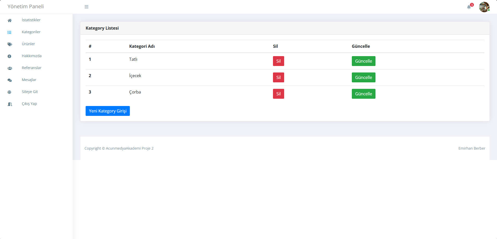
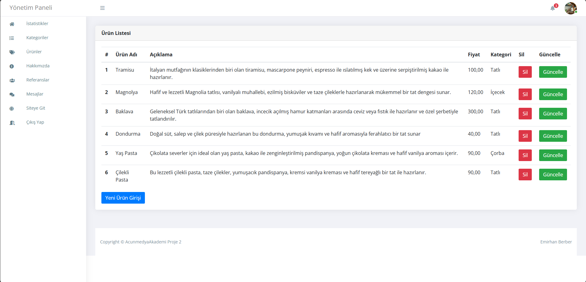
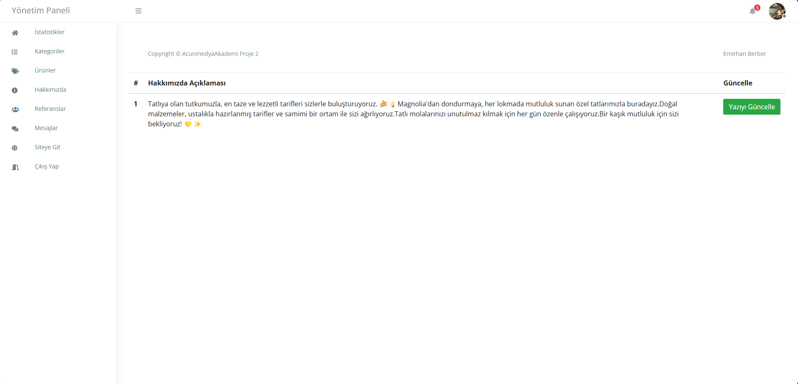
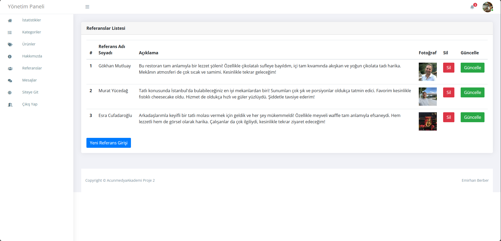
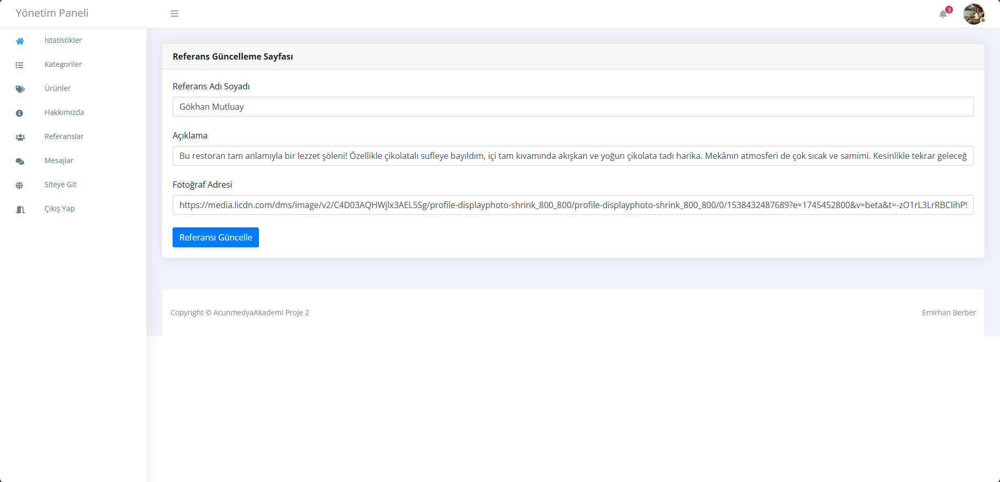  

### 🔍 Web Site
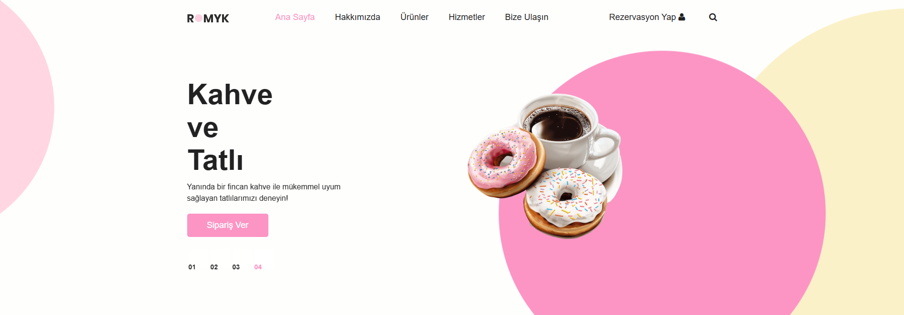  
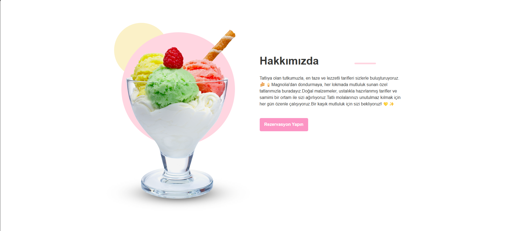
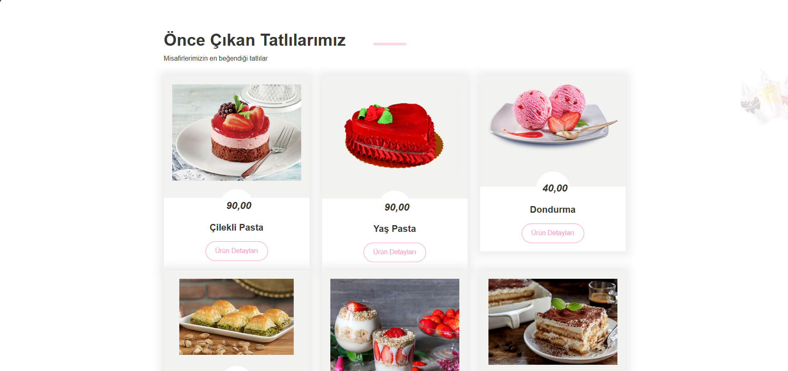
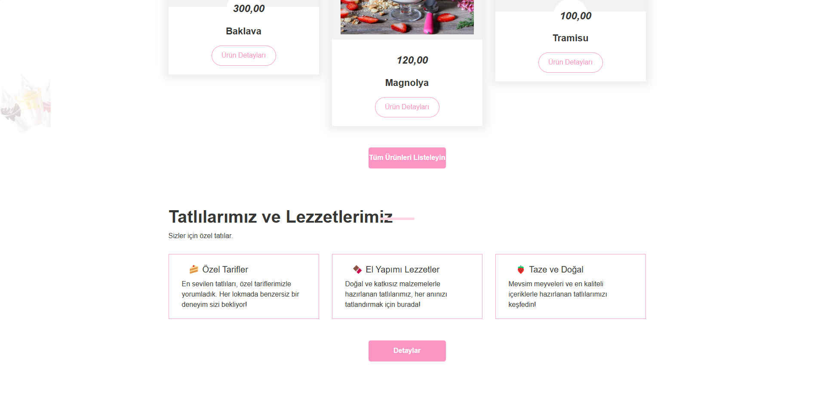
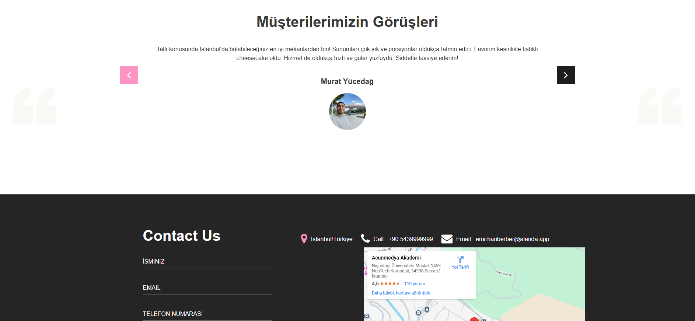
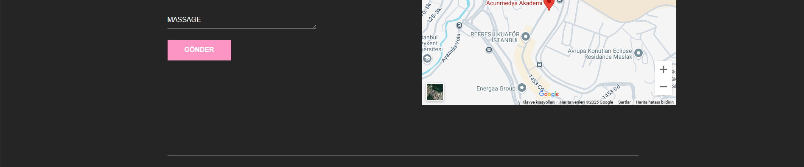  
